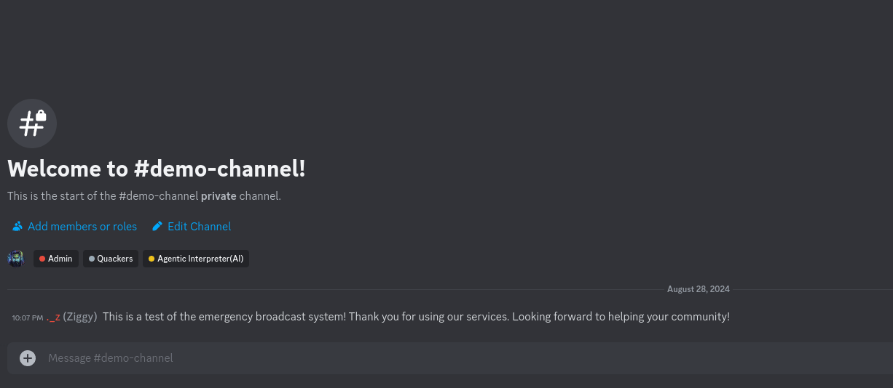

# Syllibot
## Revolutionizing Language Services with Bittensor

Syllibot leverages the power of the Bittensor network to deliver seamless AI translation and transcription services. With a focus on accuracy, speed, and ease-of-use, Syllibot is designed to streamline your language-related needs.

Syllibot is still in its early development cycle, and will support more commands and features soon. We at Agent Artificial look forward to providing your community with the services they need.

## How to Run

    
Running in Docker (Compose)

    1. Clone the repository and copy the `.env.example` to `.env`
    2. Add your `DISCORD_TOKEN` to the `.env`
    3. Start the bot using `docker compose up`

    
Running manually

    1. Clone the repository and copy the `.env.example` to `.env`
    2. Add your `DISCORD_TOKEN` to the `.env`
    3. Start the bot using `cargo run`

## Available Commands

### Slash Commands
There are currently three slash commands (with more to come):
1. `/translate_text [text] [target_language]` - Translates any text you provide into the selected language. The `target_language` field is searchable (although it's not a fuzzy search, YET).
2. `/audio_to_text [file] [source_language] [target_language]` - Lets you upload an audio file to be transcribed from the specified source language into the target language of your choice.
3. `/supported_languages` - Shows the list of currently available languages. Anything not in this list will not translate to or from anything. As we add more languages, this command will likely be deprecated.

### App Commands

[App Commands](https://discord.com/developers/docs/interactions/application-commands) are the ones available contextually within discord by hold-pressing or right clicking a user, message, channel, etc.

Currently, the only app command is `Translate` which is available on any message. Just right click (on desktop) or hold-press (on mobile) on a message, go to Apps, and click the Translate button that pops up.

---

## Languages

### Supported:
- Polish
- French
- German
- Spanish
- Romanian
- Turkish
- Dutch
- Swedish
- Slovenian
- Portuguese

### Unsupported:
- Arabic
- Chinese
- Persian
- Korean
- Japanese
